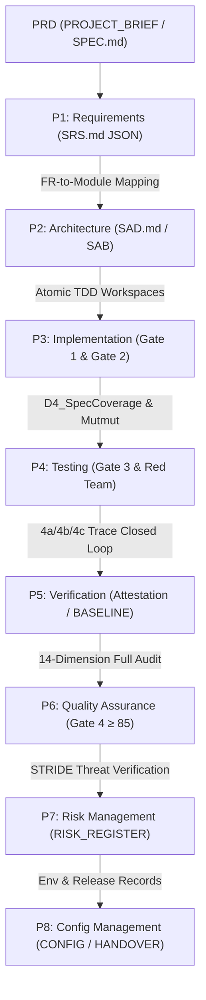

# PROJECT_BRIEF — OmniBot

> **Source spec**: SPEC.md v8.2 (2026-08-25)
> **Brief date**: 2026-08-25
> **Language**: Python 3.11
> **Delivery window**: 8–11 weeks (4 backend engineers + 2 SRE)
> **Compliance Standard**: PRD Qualitative & Quantitative Canonical Spec (P1–P8 Penetration)

---

## 1. Project Vision

OmniBot is an enterprise-grade multi-platform customer service chatbot that delivers:

- **90% First Contact Resolution (FCR)** via a 4-tier hybrid knowledge layer
- **p95 < 1.0 s** end-to-end response latency under full load (2000 TPS)
- **99.9% availability** with < 5-minute disaster recovery
- Enterprise security via the PALADIN 5-layer prompt-injection defence architecture

The bot simultaneously serves customers on **Telegram, LINE, Messenger, WhatsApp, Web, and external A2A agents**, presenting a unified interface regardless of channel.

---

## 2. Stakeholders

| Stakeholder | Concern | Key SLA / Threshold |
|-------------|---------|---------------------|
| Customer (end-user) | Fast, accurate, polite answers; smooth escalation to human agents | p95 < 1.0 s, CSAT ≥ 4.8 |
| Human Agent (customer service rep) | Real-time escalation queue; WebSocket takeover workflow | Urgent queue SLA < 5 min |
| Admin | Knowledge management, RBAC, A/B experiment control | WebUI Latency < 1.5 s |
| Editor | Knowledge CRUD without system-level access | Zero privilege leak (403) |
| Auditor | Read-only access to audit logs and CSAT metrics | Tamper-proof audit logs |
| DPO | PII decrypt rights; GDPR compliance oversight | Data deletion < 30 days |
| SRE / Ops | Cost ceiling < $500/month; runbooks; disaster recovery | MTTR < 5 min, Uptime ≥ 99.9% |

---

## 3. Business KPIs & Quantitative Acceptance Metrics

| 維度類別 | 具體指標 | 定量門檻 | 對應階段與門禁 | 測量方式 |
|---------|---------|---------|--------------|---------|
| **業務效果** | FCR (First Contact Resolution) | ≥ 90% | P1, P5 (4a/4b) | ODD SQL (conversations resolved without human) |
| **用戶體驗** | CSAT improvement | +50% vs 2025Q4 baseline (3.2 → 4.8) | P4 Gate 3, P6 Gate 4 | LLM-as-a-Judge (Politeness + Accuracy) |
| **效能表現** | p95 end-to-end latency | < 1.0 s (QPS ≥ 500 / 2000 TPS) | P4 Gate 3, P6 Gate 4 | k6 load test (4 scenarios) |
| **通路覆蓋** | 平台支援 | 6 通路 (Telegram, LINE, Meta, WA, Web, A2A) | P1, P3 Gate 1 | Functional & Integration tests |
| **服務可用** | System availability | ≥ 99.9% / month | P4 Gate 3, P8 | Prometheus uptime monitoring |
| **安全阻絕** | Security block rate | ≥ 95% (OWASP LLM01:2025) | P4 Gate 3 (Red Team) | Red-team suite + Adversarial Bug-hunt |
| **轉接時效** | Escalation SLA compliance | ≥ 95% (Urgent 5m / High 15m / Normal 30m) | P3 Gate 2, P5 | ODD SQL compliance query |
| **評測校準** | LLM-as-a-Judge agreement | Cohen's Kappa ≥ 0.7 vs human labels | P4 Gate 3 | 500-sample golden set calibration |
| **知識對齊** | Grounding check pass rate | 100% (cosine similarity ≥ 0.75) | P3 Gate 1, P4 | L5 unit tests |
| **檢索召回** | Embedding Recall@3 | ≥ 92% | P3 Gate 1, P4 | Golden set regression test |
| **災難復原** | Disaster recovery time (MTTR) | < 5 minutes | P4 Gate 3, P8 | DR drill injection |
| **營運成本** | Monthly cost ceiling | < $500 / month | P8 (Config/Handover) | Cost dashboard & monthly SQL report |
| **工具調用** | Agentic tool success rate | ≥ 95% | P3 Gate 1, P4 | Integration test harness |
| **容錯降級** | LLM fallback switch time | < 500 ms | P3 Gate 1, P4 | Fault injection test |

---

## 4. PRD Qualitative & Quantitative Guidelines

本規格書全面落實以下定性規範與定量指標，確保需求在 P1～P8 流程具備完整穿透力：

### 4.1 定性規範要求 (Qualitative Requirements)
1. **結構化標識 (Structural Identification)** `[Fact]`
   - 每個功能需求具備結構化標識（`### FR-XX: <名稱>`、`| FR-XX | ... |` 與機器可讀 JSON 區塊）。
   - 延遲與未納入範圍需求明確標記為 `FR-XX-deferred`，防止 Front-edge 檢查誤判。
2. **SAB 法定 NFR 8 大分類收斂 (SAB NFR Taxonomy)** `[Fact]`
   - 嚴格收斂為 8 大法定類別：`performance`, `security`, `maintainability`, `reliability`, `testability`, `deployability`, `scalability`, `usability`。
3. **防過度規格化原則 (Anti-over-specification / R-CANONICAL-INTERP-001)** `[Fact]`
   - 專注描述行為與驗收邊界（What/Boundary），避免在 P2 架構推導前鎖死底層私有類別或內部變數名稱（How）。
   - 衍生規格與測量邊界明確標記 `DERIVED: <line> — <rationale>`。
4. **四類原子邊界測試路徑 (4-Path Boundary Verification)** `[Inference]`
   - 每個 FR 明列：正常流程 (2xx)、認證授權 (401/403)、速率負載 (429)、異常降級與驗證失敗 (400/422/5xx)。
5. **STRIDE 安全與威脅模型前置 (STRIDE-lite Ready)** `[Inference]`
   - 明列 Spoofing, Tampering, Repudiation, Information Disclosure, Denial of Service, Elevation of Privilege 威脅與防禦策略。

### 4.2 定量指標與門檻要求 (Quantitative Thresholds)
- **追溯覆蓋 (Traceability)**: 需求追溯完整度 (TH-13/TH-14) = 100%，架構映射率 (TH-16) = 100%，測試規格覆蓋率 (D4_SpecCoverage: Gate 1 ≥ 40%, Gate 2 ≥ 60%, Gate 3 ≥ 80%, Gate 4 ≥ 90%)。
- **可實現性代碼約束**: 函式長度 ≤ 50 行，循環複雜度 (Cyclomatic Complexity) ≤ 10。
- **測試與品質門禁**: 單元測試覆蓋率 P3 ≥ 70% (TH-11), P4+ ≥ 80% (TH-12)；突變測試存活率 (Mutmut) ≥ 70%；靜態分析 Ruff ≥ 90, Pyright ≥ 85。
- **NFR 定量 SLA**: P95 Latency ≤ 1.0 s, QPS ≥ 500, Timeout ≤ 2.0 s, Max Retries = 3, Gitleaks = 100 (零洩漏), Bandit ≥ 80。

---

## 5. P1～P8 流程穿透與合規矩陣 (Phase Penetration Matrix)



| 階段 | 階段名稱 | 核心輸入與依據 | 門禁條件與定量指標 | 產出與追溯物 |
|------|---------|---------------|-------------------|-------------|
| **P1** | 需求規格化 | PRD / SPEC.md (FR-01~FR-28, NFR) | spec_alignment 通過，Agent B 審查無 Orphan/Dropped (100%) | `SRS.md` (含 JSON 規格區塊) |
| **P2** | 架構設計 | P1 SRS.md + SAB 8大分類 | FR-to-Module 映射率 100%，SAB YAML gate_score_overrides 生成 | `SAD.md`, `SAB.yaml` |
| **P3** | 模組實作 | P2 SAD.md + Atomic TDD 規範 | Gate 1 (Ruff ≥ 90, Pyright ≥ 85, Coverage ≥ 70%), Gate 2 ≥ 75 分, 函式 ≤ 50 行, CC ≤ 10 | 模組源碼, 單元測試集 |
| **P4** | 測試驗證 | PRD 四類測試邊界 + STRIDE 模型 | Gate 3 (≥ 80 分), Mutmut ≥ 70%, D4_SpecCoverage ≥ 80%, Red Team 零 Critical/High 漏洞 | 整合測試報告, 壓測報告 (k6) |
| **P5** | 交付驗證 | P1~P4 追溯鏈 (4a 代碼, 4b 測試, 4c NFR) | 需求/代碼/測試 100% 閉環追溯，Phase Truth ≥ 90% | `attestation.json` (鎖定 git_sha) |
| **P6** | 品質保證 | 全專案 14 維度綜合審查 | Gate 4 ≥ 85 分，零已知違規 | `QUALITY_AUDIT.md` |
| **P7** | 風險管理 | PRD STRIDE-lite 威脅與異常邊界 | 所有 High/Medium 威脅均具備驗證緩解措施 | `RISK_REGISTER.md` |
| **P8** | 配置管理 | PRD 環境變數、依賴與版本清單 | 部署與回滾驗證通過，MTTR < 5 min | `CONFIG_RECORDS.md`, `BASELINE.md` |

---

## 6. Functional Requirements (FR-01 ~ FR-28)

| FR ID | 功能名稱 | 核心描述與技術實現 | 模組歸屬 (P2) | 4 類測試邊界 | STRIDE 威脅 |
|-------|---------|-------------------|--------------|-------------|------------|
| **FR-01** | 多通路訊息接入與正規化 | 支援 Telegram, LINE, Messenger, WhatsApp, Web, A2A 六大通路，統一轉換為 `UnifiedMessage` | `adapters.ingress` | 200 (正規化成功), 401 (未知通路), 429 (通路過載), 422 (格式異常) | Spoofing, Tampering |
| **FR-02** | Webhook 簽名驗證與認證 | HMAC-SHA256 驗證 (4 平台)、Web JWT Bearer、A2A M2M OAuth2 Token 驗證 | `security.auth` | 200 (驗簽通過), 401 (簽名無效/過期), 429 (暴力碰撞), 400 (缺少 Header) | Spoofing, Elevation of Privilege |
| **FR-03** | PALADIN L1 輸入清理與字元正規化 | Unicode NFKC 正規化、控制字元移除、Homoglyph 偽裝字元映射替換 (延遲 < 2ms) | `security.paladin.l1` | 200 (清理完成), 403 (無效編碼), 429 (N/A), 400 (格式畸變) | Tampering |
| **FR-04** | PALADIN L2 規則過濾與特徵比對 | 正則與已知 Injection Pattern 比對，高危特徵直接阻斷 (延遲 < 3ms) | `security.paladin.l2` | 200 (無威脅), 403 (命中黑名單模式), 429 (N/A), 400 (超長輸入) | Tampering, Injection |
| **FR-05** | PALADIN L3 指令層次與三明治防護 | Sandwich Prompt 防禦、Spotlighting 標記、系統指令最高優先級隔離 (L1~L3 總延遲 < 5ms) | `security.paladin.l3` | 200 (封裝成功), 403 (越權指令), 429 (N/A), 422 (Context 溢出) | Elevation of Privilege |
| **FR-06** | PALADIN L4 語義注入分類器 | 基於輕量 LLM 的語義檢測，中風險請求非阻塞平行化異步審查 (< 200ms) | `security.paladin.l4` | 200 (分類安全), 403 (語義攻擊阻斷), 429 (評測超載降級), 504 (超時 Fail-open) | Prompt Injection, DoS |
| **FR-07** | PALADIN L5 Grounding 知識對齊檢驗 | 驗證生成的答案與檢索 Context 之語義相似度 (Cosine 相似度 ≥ 0.75) | `security.paladin.l5` | 200 (相似度≥0.75), 403 (幻覺攔截), 429 (N/A), 422 (無檢索 Context) | Information Disclosure |
| **FR-08** | PII 偵測、去識別化與 Luhn 校驗 | 偵測電話、Email、台灣地址、信用卡 (Luhn 演算法)，敏感字詞自動遮蔽與轉接 | `security.pii` | 200 (遮蔽成功), 403 (解密未授權), 429 (N/A), 422 (格式不合) | Information Disclosure |
| **FR-09** | 分散式速率限制 (Rate Limiting) | Redis Sliding Window + Lua 腳本；依通路設定 10~100 req/s；Redis 故障時 Fail-open | `gateway.ratelimit` | 200 (配額內), 401 (N/A), 429 (超額阻斷), 500 (Redis 斷線降級) | Denial of Service |
| **FR-10** | CIDR 格式 IP 白名單檢查 | 支援最多 100 組 CIDR 區段比對；先於簽名驗證執行；不匹配回傳 403 Fail-secure | `gateway.ipfilter` | 200 (白名單內), 403 (非允許 IP), 429 (N/A), 400 (Header 畸形) | Spoofing, DoS |
| **FR-11** | 多輪情緒分析與衰減模型 | 正/中/負情緒評分 (0~1)；24 小時半衰期衰減；連續 3 輪負面自動升級轉接 (AGENT 通路 Bypass) | `nlp.emotion` | 200 (分析完成), 401 (N/A), 429 (N/A), 422 (空文本) | Repudiation |
| **FR-12** | 對話狀態追蹤 (DST) 與意圖路由 | 8 狀態有限狀態機 (FSM)；槽位填充 (Slot-filling)；信心度 < 0.65 或 3 次未填滿自動轉接 | `dialogue.dst` | 200 (狀態轉移成功), 401 (N/A), 429 (N/A), 422 (意圖無法解析) | Repudiation |
| **FR-13** | 知識檢索 Tier 1 (PostgreSQL 規則匹配) | ILIKE 精確關鍵字比對；目標覆蓋率 40%；信心度閾值 ≥ 0.80 | `knowledge.tier1` | 200 (命中回傳), 401 (N/A), 429 (N/A), 404 (未命中轉 Tier 2) | Information Disclosure |
| **FR-14** | 知識檢索 Tier 2 (pgvector HNSW + RRF) | 1536 維向量搜尋 (m=16, ef=64) + RRF k=60 融合 + Parent-Child 階層切分 (150t/500t) | `knowledge.tier2` | 200 (檢索成功), 401 (N/A), 429 (N/A), 500 (向量庫降級 tsvector) | Information Disclosure |
| **FR-15** | 知識檢索 Tier 3 (LLM 生成與多模型備援) | 主模型 gpt-4o 生成，發生異常於 < 500ms 內自動降級切換至 gemini-1.5-flash | `knowledge.tier3` | 200 (生成成功), 401 (Key 錯誤), 429 (LLM 限流降級), 504 (超時轉接) | Repudiation |
| **FR-16** | 動作執行引擎 (Agentic Action Execution) | 插件註冊表與 MCP Client (外部工具), A2A Client (對等 Agent, 2s 逾時), CLI Adapter (沙箱腳本) | `action.engine` | 200 (工具執行成功), 403 (工具權限不足), 429 (工具速率上限), 504 (工具超時) | Elevation of Privilege |
| **FR-17** | 回覆生成與語氣調適 | 依情緒評分與通路特性動態調整 Prompt 語氣 (如 zh-TW 敬語、Quick Replies) | `response.generator`| 200 (渲染成功), 401 (N/A), 429 (N/A), 422 (模板變數缺失) | Tampering |
| **FR-18** | 7 大角色 RBAC 權限管理 | anonymous, customer, agent, editor, admin, auditor, dpo 角色與裝飾器中介層防護 | `security.rbac` | 200 (授權成功), 401 (未登入), 403 (權限不足), 422 (角色無效) | Elevation of Privilege |
| **FR-19** | 人工轉接與 SLA 優先佇列 | 緊急 (5min)、高 (15min)、一般 (30min) 佇列；WebSocket `/ws/agent` 與 `/ws/user` 即時同步 | `escalation.queue` | 200 (入隊/接管成功), 401 (WebSocket 無憑證), 429 (佇列滿載), 500 (連線中斷) | Denial of Service |
| **FR-20** | LLM-as-a-Judge 評測框架 | Ensemble Judge (gpt-4o-mini + claude-3-5-haiku, Temp 0.0)；Politeness (max) / Accuracy (min) | `eval.judge` | 200 (評測完成), 401 (N/A), 429 (抽樣評測限流), 504 (Judge 超時重試) | Repudiation |
| **FR-21** | 結構化可觀測性與分散式追蹤 | JSON 結構化日誌、Prometheus 指標、OpenTelemetry Trace Context、Grafana 儀表板與告警 | `observability` | 200 (指標輸出正常), 401 (Metrics 端點保護), 429 (日誌採樣), 500 (監控斷線) | Repudiation |
| **FR-22** | 異步背景任務系統 (SAQ Worker) | SAQ 分散式佇列處理 Embedding 生成 (p95 < 30s)；知識寫入時同步首 Chunk 消除搜尋黑暗期 | `background.saq` | 200 (任務完成), 401 (N/A), 429 (任務堆疊告警), 500 (重試 3 次入死信) | Denial of Service |
| **FR-23** | GDPR 資料生命週期與合規管理 | 支援用戶資料匯出 (`GET /users/{id}/data`)、刪除 (`DELETE /users/{id}/data`)、180天/2年冷存檔與匿名化 | `compliance.gdpr` | 200 (匯出/刪除成功), 401 (Token 無效), 403 (非 DPO/本人), 404 (用戶不存在) | Information Disclosure |
| **FR-24** | A/B Testing 實驗框架 | 基於 SHA-256 確定性雜湊分流；流量分配控制；實驗指標自動收集 | `experiment.ab` | 200 (分流成功), 401 (管理端保護), 403 (未授權), 422 (分流參數錯誤) | Tampering |
| **FR-25** | 多媒體訊息處理與處置策略 | 文字走標準管線；圖片/檔案自動觸發轉接；貼圖親和引導；地理位置解析坐標注入 Context | `adapters.media` | 200 (處置成功), 401 (驗簽失敗), 429 (檔案過大), 422 (未知格式) | Denial of Service |
| **FR-26** | 使用者與 M2M Token 管理 API | JWT 簽發/輪替/撤銷；後台使用者 CRUD；M2M Client Credentials 發行 (A2A 專用) | `security.user_m2m` | 200 (簽發/查詢成功), 401 (憑證無效), 403 (非 Admin), 422 (密碼強度不足) | Elevation of Privilege |
| **FR-27** | 對話上下文視窗管理 | 滑動視窗 (Sliding Window) + 長對話自動摘要 (Summarization)，防止超出 Token 上限 | `dialogue.context` | 200 (裁剪/摘要成功), 401 (N/A), 429 (N/A), 422 (序列化失敗) | Denial of Service |
| **FR-28** | 高可用性、Redis 異步流與故障隔離 | Redis Streams 異步解耦；Circuit Breaker 熔斷機制；指數退避重試 (Max 3 次) | `core.ha` | 200 (處理正常), 401 (N/A), 429 (熔斷開啟降級), 500 (依賴隔離) | Denial of Service |

### 延遲需求清單 (Deferred Requirements)
| FR ID | 需求名稱 | 延遲原因與未來規劃 |
|-------|---------|------------------|
| `FR-29-deferred` | 原生多模態視覺理解 (Vision QA) | 需待多模態專用 GPU 推理成本降低後於 v9.0 引入 (GPT-4V / Claude Vision) |
| `FR-30-deferred` | 檔案與文件 OCR/AI 解析 | 現階段由人工客服介入處理，預計於 v9.1 引入 Document AI 模組 |
| `FR-31-deferred` | 即時語音與音訊串流處理 | 避免端到端延遲突破 1.0s 門檻，保留至未來語音專用通道專案 |
| `FR-32-deferred` | 繁中與英文以外之多語系支援 | 目前業務專注於台灣與英語系用戶，其他語系納入國際化階段評估 |
| `FR-33-deferred` | 自建 In-house LLM 微調管線 | 目前專注於 Prompt Engineering + RAG + Judge 校準，微調成本效益尚待評估 |
| `FR-34-deferred` | 原生行動端 App (iOS / Android) | 依託 Telegram / LINE / WhatsApp / Messenger / Web 原生介面，不另行開發 App |

---

## 7. Non-Functional Requirements (SAB 8 大法定類別)

```yaml
nfr_taxonomy:
  performance:
    p95_e2e_latency: "< 1.0 s under 2000 TPS"
    l1_l3_security_budget: "< 5 ms"
    l4_semantic_classifier_async: "< 200 ms (parallel non-blocking)"
    embedding_api_latency: "< 100 ms"
    knowledge_search_p95: "< 150 ms"
  security:
    owasp_compliance: "OWASP LLM01:2025 compliant (PALADIN 5-layer defense)"
    secret_scanning: "Gitleaks score = 100 (zero leakage in repo & commit history)"
    static_security_analysis: "Bandit score >= 80"
    data_encryption: "PostgreSQL TDE at rest + TLS 1.3 in transit + Redis TLS/AUTH/ACL"
    rbac_roles: "7 distinct roles with least privilege principle enforced"
  maintainability:
    max_function_length: "<= 50 lines (Constitution §1.2)"
    cyclomatic_complexity: "<= 10 per function (radon-mi)"
    static_lint_quality: "Ruff >= 90"
    type_checker_quality: "Pyright >= 85"
    db_migrations: "Alembic automated versioned migrations"
  reliability:
    system_availability: ">= 99.9% monthly uptime"
    service_timeout: "<= 2.0 s (A2A RPC & External tool call)"
    retry_policy: "Max 3 retries with exponential backoff and jitter"
    fallback_graceful_degradation: "LLM fallback switch time < 500 ms; Redis fail-open"
    disaster_recovery_mttr: "< 5 minutes"
  testability:
    unit_line_coverage: "P3 >= 70% (TH-11), P4+ >= 80% (TH-12)"
    mutation_testing_score: ">= 70% (mutmut survival score)"
    spec_coverage_d4: "Gate 1 >= 40%, Gate 2 >= 60%, Gate 3 >= 80%, Gate 4 >= 90%"
    golden_dataset: ">= 500 validated samples with Cohen's Kappa >= 0.7 calibration"
  deployability: # advisory
    containerization: "Docker Compose (dev) + Kubernetes Deployment/Service (prod)"
    autoscaling: "Horizontal Pod Autoscaler (HPA: CPU > 70%, Memory > 80%)"
    rollback_strategy: "Automated container rollback < 5 minutes"
  scalability: # advisory
    sustained_throughput: "2000 TPS sustained under 4 k6 load test scenarios"
    vector_scalability: "pgvector HNSW index (m=16, ef_construction=64)"
    distributed_caching: "Redis Cluster ready with connection pooling"
  usability: # advisory
    csat_score: ">= 4.8 / 5.0 (+50% vs 2025Q4 baseline)"
    language_politeness: "LLM-as-a-Judge Politeness >= 4.5/5.0 with zh-TW empathy"
    admin_ui_latency: "< 1.5 s page load for Knowledge & SLA dashboards"
```

---

## 8. Technical Stack

| Component | Technology | Version / Configuration |
|-----------|-----------|------------------------|
| **Runtime** | Python | 3.11 (uv-managed virtualenv) |
| **Web Framework** | FastAPI + Uvicorn | 0.110+ (Async ASGI) |
| **Database** | PostgreSQL + pgvector | PostgreSQL 16 + pgvector 0.7+ (HNSW index) |
| **Cache & Queue** | Redis | 7.2+ (Streams for async jobs, ZSET for sliding rate limit) |
| **Embedding** | OpenAI text-embedding-3-small | 1536-dim (Fallback: tsvector / Local bge-m3) |
| **Primary LLM** | gpt-4o | Tier 3 QA generation |
| **Fallback LLM** | gemini-1.5-flash | Automated failover (< 500 ms) |
| **Judge LLMs** | gpt-4o-mini + claude-3-5-haiku | Ensemble LLM-as-a-Judge (Temp 0.0) |
| **Background Jobs** | SAQ (Simple Async Queue) | Async worker for embedding & batch jobs |
| **Deployment** | Docker & Kubernetes | Docker Compose (dev), K8s Deployment + HPA (prod) |
| **Observability** | Prometheus + Grafana + OpenTelemetry | Distributed tracing + JSON structured logging |
| **Load Testing** | k6 | 4 load scenarios (2000 TPS target) |
| **Static Tools** | Ruff, Pyright, Bandit, Gitleaks, Mutmut | Quality gates & security audits |

---

## 9. Delivery Milestones

| Milestone | Window | Key Deliverables & Gate Criteria |
|-----------|--------|----------------------------------|
| **M1: Core Ingress & Knowledge** | Weeks 1–3 | FR-01~05, FR-08~10, FR-12~15. Gate 1 (Ruff ≥ 90, Pyright ≥ 85, Coverage ≥ 70%). |
| **M2: Security & Workflow** | Weeks 4–6 | FR-06~07, FR-11, FR-16~21, FR-24. Gate 2 (Score ≥ 75, Mutmut ≥ 70%). |
| **M3: Reliability & Infra** | Weeks 6–8 | FR-28, TDE, K8s HPA, k6 2000 TPS, 500 Golden Dataset, Gate 3 (Score ≥ 80). |
| **M4: Background & Compliance** | Weeks 8–11 | FR-22~23, FR-25~27, WebSocket, M2M Token, Gate 4 (Score ≥ 85), Handover. |

---

## 10. Known Constraints, Risks & STRIDE Mitigation

| Risk / Threat | STRIDE | Likelihood | Impact | Mitigation & SLA |
|---------------|--------|------------|--------|------------------|
| LLM API Latency Spike (> 800ms) | Denial of Service | Medium | High | L4 parallel async pipeline; Gemini fallback switch < 500 ms |
| Prompt Injection / Jailbreak | Tampering / Elevation | High | Critical | PALADIN 5-layer defence (L1 NFKC -> L2 Regex -> L3 Sandwich -> L4 LLM -> L5 Grounding) |
| PII Leakage in Logs / Context | Information Disclosure | Medium | Critical | Luhn-validated masking at L4, DPO decrypt audit trail, GDPR 90-day anonymization |
| Redis Service Crash | Denial of Service | Low | Medium | Distributed Rate Limiter fail-open by design, Sentinel / Cluster auto-failover |
| Webhook Signature Forgery | Spoofing | Medium | Critical | Per-platform HMAC-SHA256 verification + IP Whitelist prior to ingestion |
| pgvector HNSW Recall Degradation | Denial of Service | Low | Medium | Parent-Child chunking + Periodic index vacuum & reindexing |
| LLM Judge Bias Drift | Repudiation | Medium | Medium | 500-sample golden set monthly recalibration (Cohen's Kappa ≥ 0.7 trigger) |
| Operational Cost Overrun | Denial of Service | Low | Medium | Rate limiting, 20% judge sampling, tiered caching, budget ceiling < $500/mo |

---

## 11. Out of Scope & Deferred Backlog (v8.2)

- `FR-29-deferred`: Native Multimodal Vision Understanding (Image/Video QA)
- `FR-30-deferred`: File & Document OCR/AI Parsing
- `FR-31-deferred`: Real-time Voice & Audio Streaming
- `FR-32-deferred`: Multi-language Support Beyond zh-TW and English
- `FR-33-deferred`: Custom In-house LLM Fine-tuning Pipeline
- `FR-34-deferred`: Native Mobile Applications (iOS / Android)
